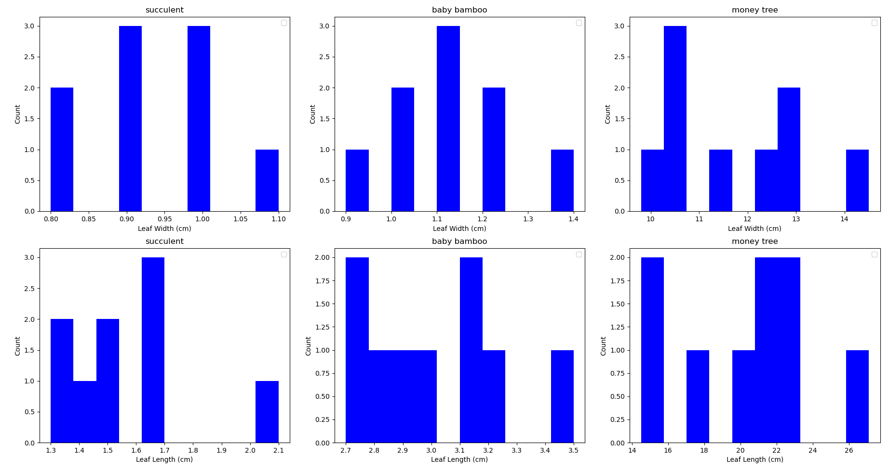
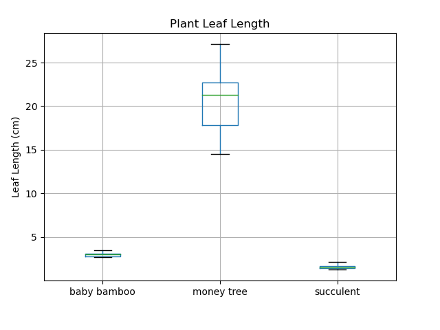
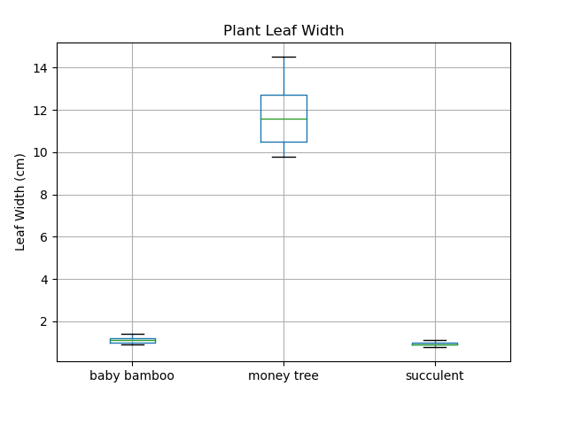
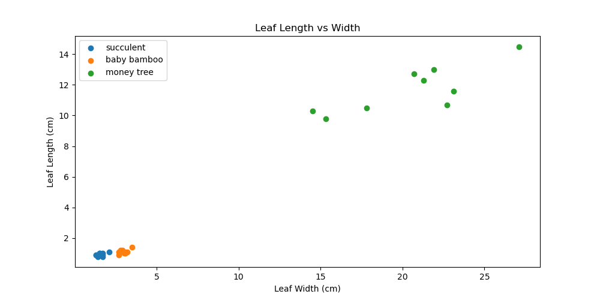

# HW2
DS5110  
Homework 2 - Data Collection  
01/23/2025  
Zichong Meng  
### Question Answering:
1. I decide tomearsure the three different plants (different species) in my home. The three species are succulent, baby bamboo and money tree (guiana chestnut). For each plant species, I randomly choose to collect 9 data points (leaf length and width) and write down (and the later write in csv file) the exact numerical number to neareast decimal place.
2. I adopt a standard 30 centimeter with millimeter as smallest unit on it as the measureming instrument.
3. Since the leafs millimeter is relatively already a small unit for plant leaves for succulent, baby bamboo and money tree, I think using the 30 cm centimeter ruler with millimeter on it is accurate and precise. Also, I decide to measure each leaf three times and use the average to be more accurate and precise.
4. In the end, I collect 9 data points for each of the three plant species. This is because for baby bamboo, it does not have too many leafs and I want to include the same amount of leafs for three different plant species. And I think randomly slected 9 data points for each one of them can already present the distribution of the data in some way.
5. So in my dataset, N = 27 and n = 9 for each one of the three.
6. One problem I went into is that money tree leafs is relatively hard to measure because of its size, so I measure it three times and take the average for more accuracy.  
### Analysis/Visualization:
1. The historgam result (also can be obtain using HW2.py)
2. The box plot results (also can be obtain using HW2.py)
3. The scatter plot results (also can be obtain using HW2.py)
4. The historgram shows for each plant species the overall distribution of their leaf length and width. The box plots shows that scucculent tens to have very small variance and standard, standard deviation, while money tree tends to have a larger standard deviation and variance. From the scatter plots we can see a positive correlation relationship between leaf length and leaf width.
5. Succulent and baby bamboos tends to have small leaves therefore the mean, medium, variance and standard deviation is small, but money tree leavs are larger, therefore the mean, medium, variance and standard deviation is larger compared to succulent and baby bamboos. And leaf length and width tends to be positive correlated.
